<<<<<<< HEAD
# Tests

## General Instructions

Tests during the project will be placed here. The directory structure is the following.

1. ```./local_test``` folder : All the scripts and tests executed in the local machine.
2. ```./gcp_test``` folder: All the scripts related to Google Cloud Platform and Tensorflow.


## ./local_tests folder

Contains the following scripts.

1.  ```test01.py```:  Test 01 training script.
2.  ```test02.py```:  Test02 training script.
3.  ```test03.py```: Test03 training script.
4.  ```test1.py```: Test 1 training script, originally a Google Colab notebook.
5.  ```test2.py```: Test 2 training script, originally a Google Colab notebook.
6.  ```test3.py```: Test 3 training script, originally a Google Colab notebook.
7.  ```test4.py```: Test 4 training script, originally a Google Colab notebook.
8.  ```test5.py```: Test 5 training script, originally a Google Colab notebook.


## ./gcp_test

Contains the following scripts.

1.  ```comparation_gcp.py```
2.  ```data_augmentation.py```
3.  ```gcp_test.py```
4.  ```image_classification.py```
5.  ```load_model_gcp.py```
6.  ```rail_classification.py```
7.  ```tt.py```

## Tests


### Datasets

#### Nomenclature

The inspection images were captured in a high resolution of 4000x3000 pixels. To differentiate each preprocessed dataset, a nomenclature was defined to name the transformed dataset according to the transformation or preprocessing strategy. The possible suffixes for image classification are:

1. *rsN* : when damages are extracted and re-scaled to a fixed size of *NxN* pixels.

2. *wN* : when N square crops were extracted from each image.

For example, ds-00-rs224-v00 is based on the ds-00 dataset and re-scaled to a resolution of 256x256, identified as the version 00 of the preprocessed dataset. 

The following are the raw datasets that the client has sent us:

    Name: d-00
    
    Date: 12 February 2021

    Size: 84 images (4000x3000)

    Classified: No

.
    
    Name: d-01

    Date: 25 February 2021

    Size: 206 images (variable resolution)

    Classified: Yes

.
    
    Name: d-03

    Date: 4 March 2021

    Size: 2653 images (variable resolution)

    Classified: No

    Comment: ds-02 and the reports merged (and duplicates removed). All kinds of images with a lot of noise (not only faults).


  
   Name: d-04

    Date: 18 March 2021

    Size: 17649 images (variable resolution)

    Classified: No

    Comment: ds-02, the old reports and new reports merged (and duplicates removed). All kinds of images with a lot of noise (not only faults).

###  Image classification

The available d-00 dataset is relatively small. The ds-00 consists of less than 100 images with damages. The images are unclassified.

The d-01dataset is bigger than he previous one, containing 206 images. The images are classified in 53 types of damages, according to the fault cataloge. Some classes containg 0 images, and the five most common faults are BA-Erosion-DanosEnRecubrimiento" (23),"Aerofreno-DanosPorMalCierre" (17), 
"BA-Erosion-DanosEnLaminad" (16)
"Aerofreno-AusenciaCono"(14) and "Palasana-PalaSanaOrigianl"(14). Remark that the hierarchical structure of the classification actalogue is due to the location of the fault in the wind blade. 


###  <u>TEST 01</u>


Test perfomed on the *d-00-rs224-v00* dataset. The available d-00 dataset is relatively small. The ds-00 consists of less than 100 images with damages. Each damage is cropped from the original image and then resized to the input size of the neural network. Two labels are used to train the model: damaged and n-a. Train and validation set contain  92 and 23 images respectively (80%-20%). Random fliping and rotation are applyed before every iteration as a data augmentation technique. *ResNet101* is used as a base model with `base_model.trainable=False`. Then average pooling, a dropout layer and a dense layer are applyed to obtain the predictions. The prediction will be treated as a logit, considering there are only two classes. Test01 implementation can be found in ```test01.py```. The model hyperparameters were selected randomly:

1. `Test 01.1`: random rotation=0.2, learning rate=0.1, dropout=0.3, batch size = 15 and epochs=50.

  <p align="center">
    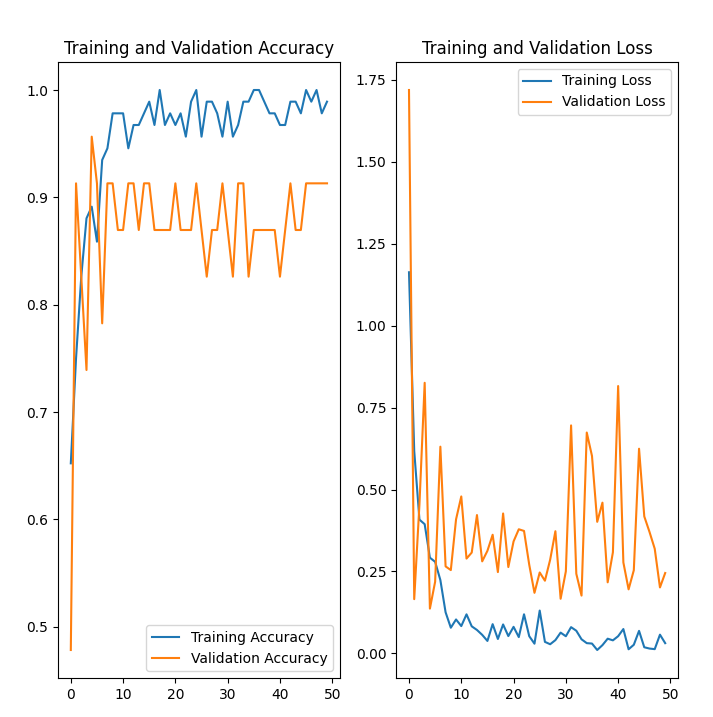
  </p>


2. `Test 01.2`: random rotation=0.2, learning rate=0.00001, dropout=0.2, batch_size = 15 and epochs=50.

  <p align="center">
    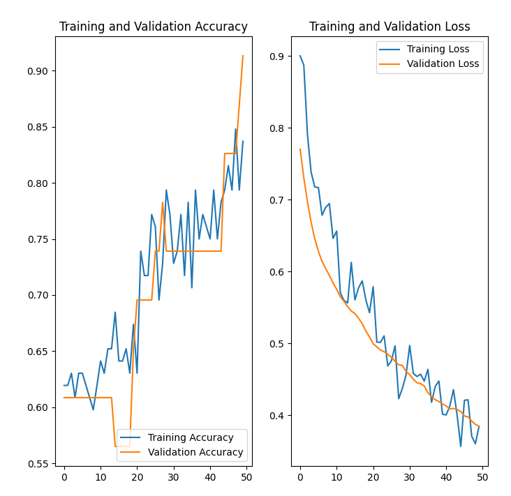
  </p>

Example of predictions from test 01:

  <p align="center">
  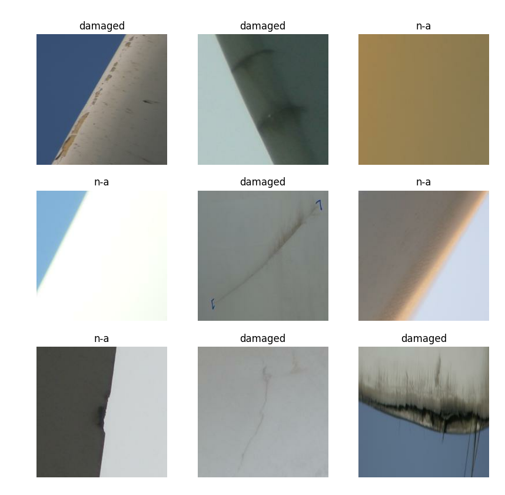
  </p>


###  <u>TEST 02</u>


Test perfomed on the *d-00-rs224-v00* dataset. The settings are similar to test01, but this time all the base model layers are set as trainable, namely, `base_model.trainable=True`. The selecter hyperparameters are random rotation=0.2, learning rate=0.001, dropout=0.5, batch_size=15 and epochs=200. 

  <p align="center">
    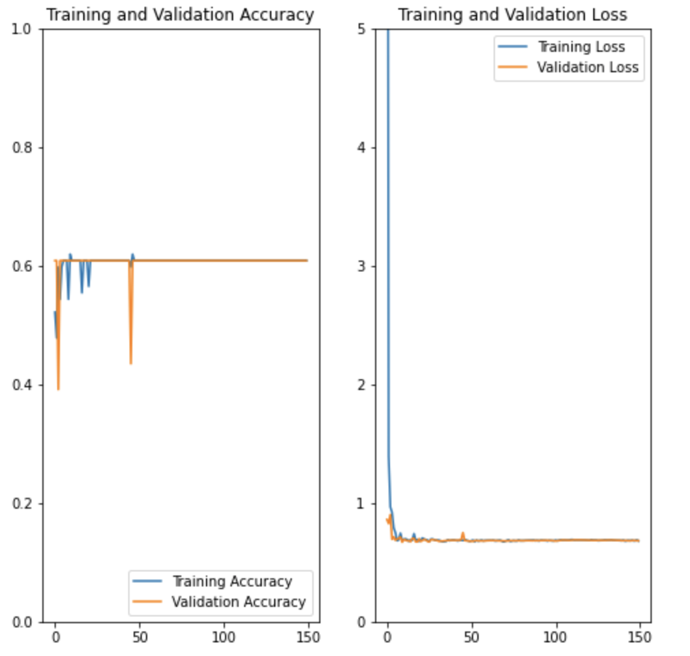
  </p>

  
Example of predictions from test 02:

  <p align="center">
  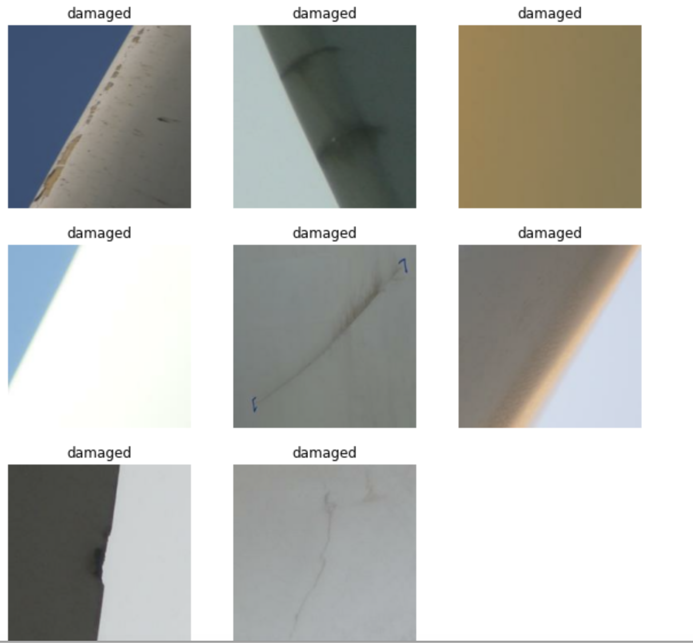
  </p>


###  <u>TEST 03</u>


Test perfomed on the *d-00-rs224-v00* dataset. The settings are similar to test01, but this time some of the last layers of the base model  are set as trainable after first training the model with the base model frozen. The selecter hyperparameters are random rotation=0.2, dropout=0.4 and batch_size=15. The fist 100 epochs are trained with `base_model.trainable=False` and a learningrate of 0.001. The following 30 epochs are trained with first 100 layers of *ResNet50* frozen and a smaller learning rate of 0.0001. 

<p align="center">
    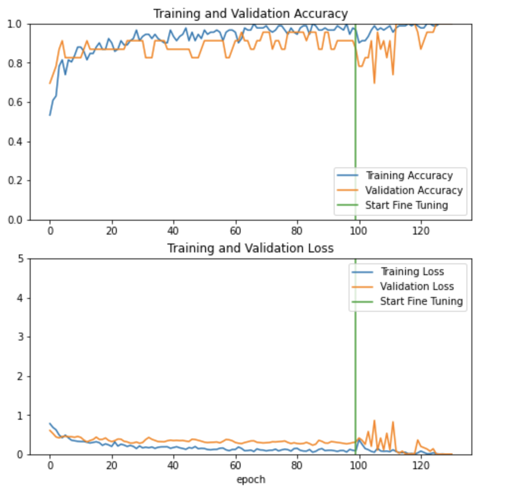
</p>


Example of predictions from test 03:

<p float="left">
  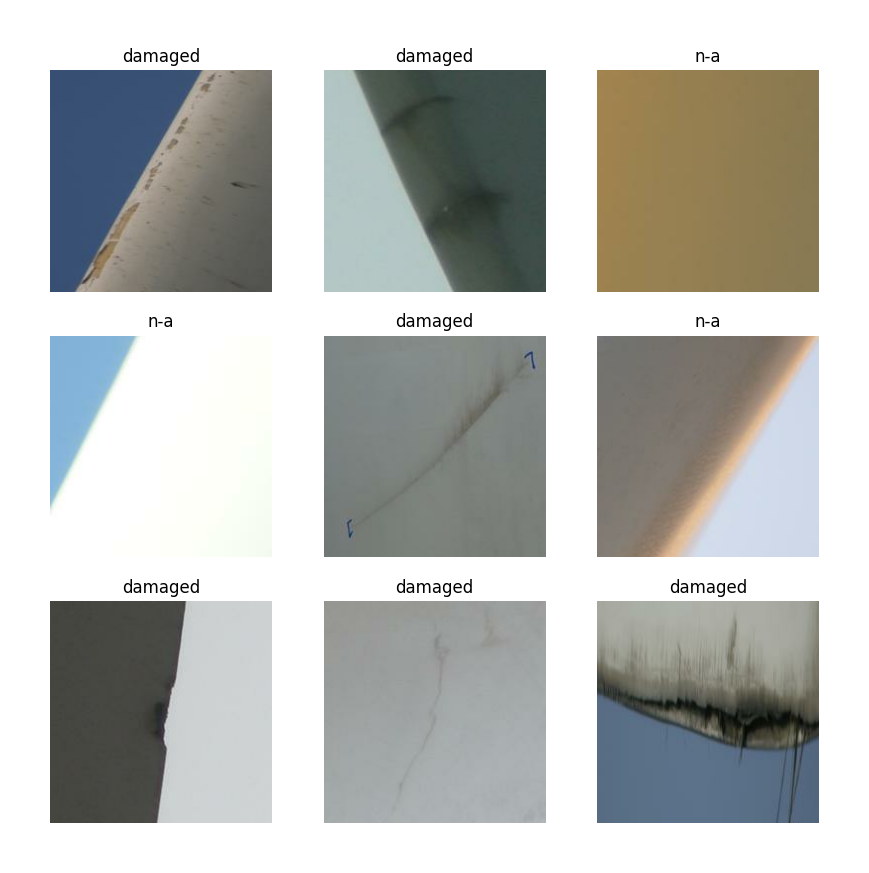
  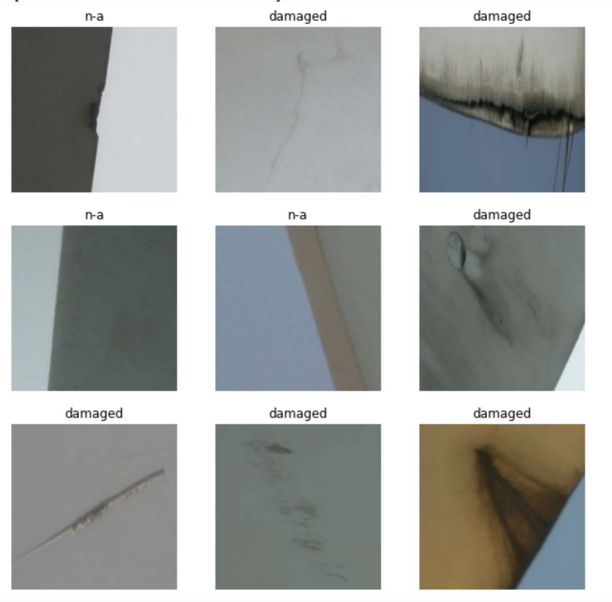 
  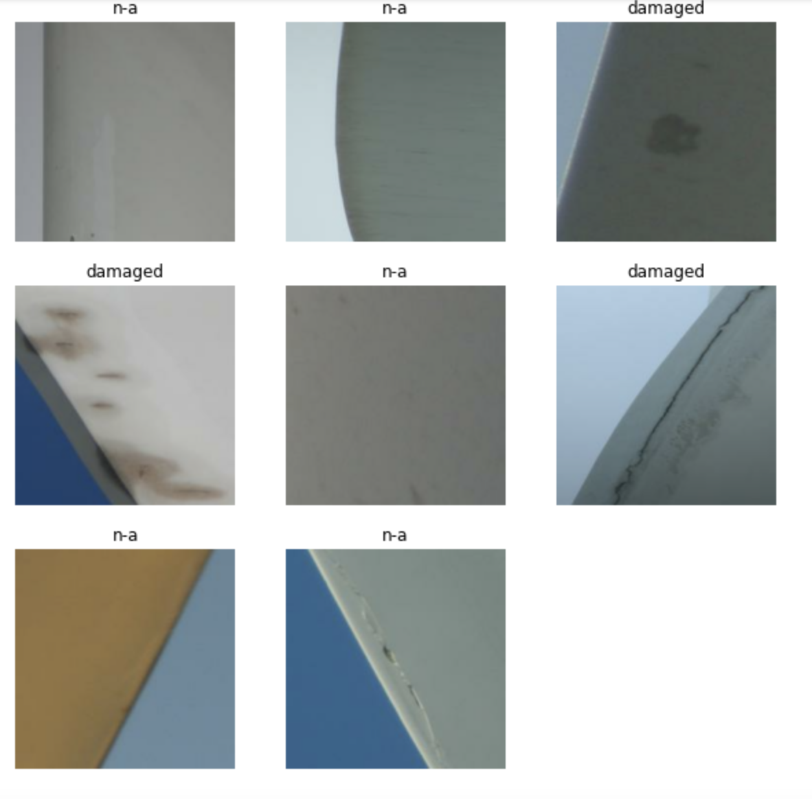
</p>


###  <u>TEST 10</u>

Test performed on the *d-00-w9-rs224-v00* dataset. The crops from d-00 were obtained automatically using a python script. From each image, 9 sub-images were obtained. In total, after deleting some redundant images (100% blue) and the respective labeling (manually done by me). Approximately 30% of the images were labeled as "damaged" during the pre-processing step. The *d-00-w9-rs224-v00* contains  484 and 112 images for training and validation respectively (80-20 split). The model used is the same as the one used in *test 03*, using a frozen *ResNet50* during the first phase of training, and setting some layers of the base model as trainable in the second phase.  The hyperparameters are the same, namely, random rotation=0.2, dropout=0.4 and batch_size=15. The first 100 epochs are trained with `base_model.trainable=False` and a learning rate of 0.001. The following 30 epochs are trained with the first 100 layers of *ResNet50* frozen and a smaller learning rate of 0.0001. 


Remark that no hyperparameter tunning or other techniques to improve model performance were used. The goal of this test was to have an idea of how a CNN can perform on the given task.


<p align="center">
    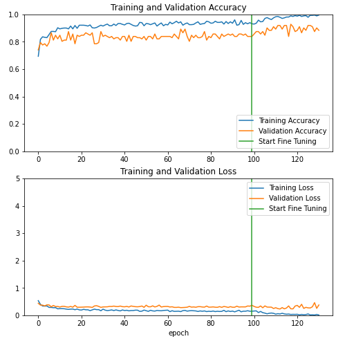
</p>


Example of predictions from test 10:

<p float="left">
  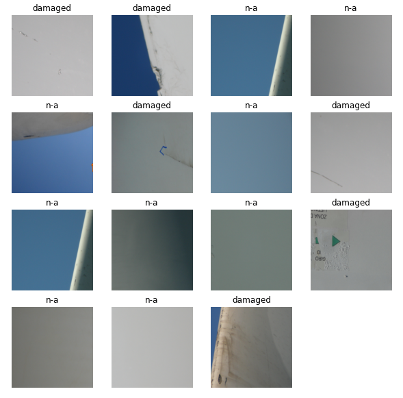
  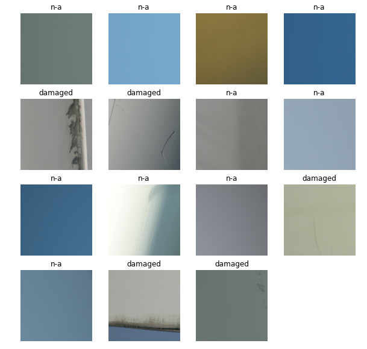 
</p>

<p float="left">
  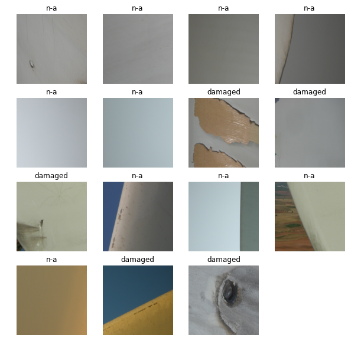
  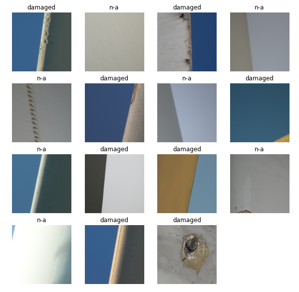 
</p>


An original image from *d00* (4000x3000 pixels) was selected and croped to see how the model was perorming.

<p align="center">
    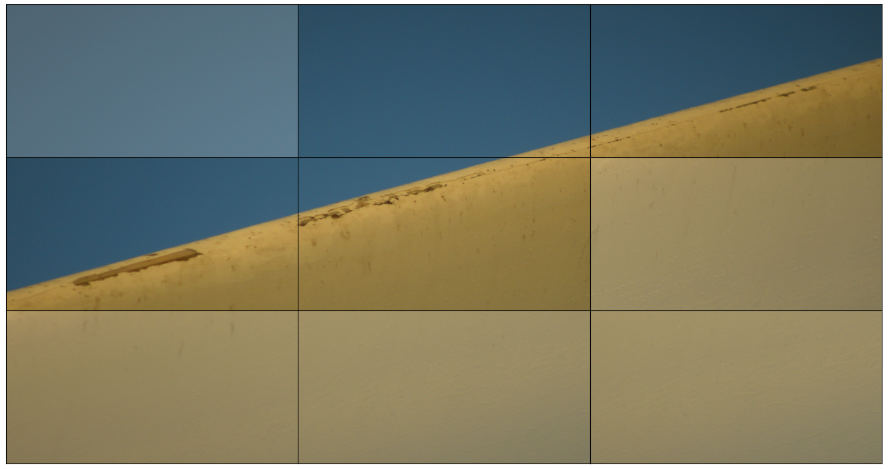
</p>


###  <u>TEST 2</u>

The idea of this test is to see the performance of the scheme used in *Test 10* to the dataset *ds-01*, which contains more images. *ds-01* contains around 200 classified high-resolution images of faults. There are more than 15 types of faults, some of them containing less than 5 samples. Therefore, it is unfeasible to start trying to classify all the faults from the very beginning. The purpose of this test is to be able to differentiate images that contain a damaged zone from healthy images. The images of the most common faults were selected from *ds-01**, namely, erosions, cracks, and breaks. In total 160 images were selected from the dataset. Then, the procedure was the same as in the previous test: extract nine crops per image, manually label the crops as "damaged" or "n-a", and resize the images to 224x224 resolution. Further, some crops were deleted due to containing unusual backgrounds, being out of focus, or helping the class balance. There were 1450 crops in total, and after the pre-processing the dataset contained 789 with the "n-a" label and 323 "damaged". The train/val split was 80-20. The obtained dataset is named as **ds01-v02-w9-rs224**.

The training was done using the *Google Colab* tool, which allows running TensorFlow operations on a GPU (Nvidia K80), drastically improving the speed of the training. Based on the previous test, the idea of using transfer-learning with a prediction looked very promising. Several base models were tested, such as ResNet50,ResNet101, DenseNet, EfficientNet, MobileNet and VGG16. Considering the size of the dataset and the obtained results, very deep nets such as VGG16 or ResNet101  were performing poorly during the tests. The **ResNet50** with weights pre-trained on ImageNet was the 'winner' of the tests. The classification head was kept simple, using a 2D global average pooling, dropout layer, and dense layer to obtain the predictions. Remark that other classification heads with more FC layers, or using batch normalization instead of dropout were tested, concluding in very similar results. The hyperparameters were selected by doing a grid-search. The batch size was set to 15 after trying different batch sizes (15,32 and 64). The epochs were set to 50 frozen epochs and 50 unfrozen epochs after trying different combinations (100-50,100-100,..). The dropout rate was set to 0.5, which is considered to be a standard value based on the literature (variations did not affect at all the performance). The last 50 layers of the base model were unfrozen in the second part of the training. The initial learning rate was 0.0001, which is divided by 10 for the fine-tuning part. In conclusion, the best performing model was the following: 

  Prediction head: GlobalAveragePooling2D + Dropout + Dense(1)

	Base model: ResNet50 on Imagenet

	Data augmentation: RandomFlip(0.2) + RandomRotation + RandomContrasts (0.6)

	Frozen_epochs: 50

	Unfrozen epochs: 50

	Batch size: 32

	Dropout rate: 0.5

	Optimizer: Adam

	Initial learning rate: 0.00001

	Learning rate decrease factor: 10

	Unfrozen layers: 50

Training took around 15 minutes. To make sure that the results did not depend on the train/val split, 4-fold cross validation was applied creating 4 different test/val sets. The following are the obtained metrics: 

| Metrics      | Fold1     | Fold2     | Fold3 | Fold4 |
| :------------- | :----------: | :-----------: | :------:|  :-------: |
|  Train accuracy |  0.97  |   0.955 | 0.968 | 0.961 
|  Train loss | 0.006   | 0.083   | 0.074 | 0.092
|  Val accuracy| 0.918   | 0.890    | 0.922 | 0.890
|  Val loss | 0.460  | 0.290    | 0.337 | 0.250
|  TP | 133  | 144   | 143 | 147
|  TN| 52   | 54    | 58 | 50
|  FP | 11   | 10    | 6 | 14
|  FN | 14   | 11    | 12 | 8
|  Precision | 0.924   | 0.935    | 0.956 | 0.913
|  Recall | 0.904   | 0.930    | 0.922 | 0.948


<br/><br/>
 
The model of the first fold will be the one saved. The model has a 0.91 accuracy, 0.92 precision, 0.90 recall and the following confusion matrix:

| TRUE\PREDICTED     | n-a     | damaged     |
| :------------- | :----------: | :-----------: | 
|  n-a |  92% |   8% |
|  damaged | 21%   | 79%   | 


<br/><br/>

The TensorFLow model can be found in ```./local_test/models/model-test2```, and the respective script is ```test2.py```. The following are tests performed to three images extracted from the pdf reports.  

<br/><br/>

<p align="center">
    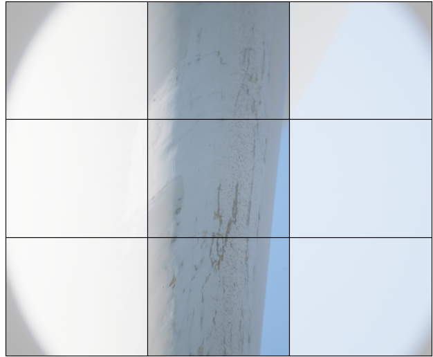
</p>

<p align="center">
    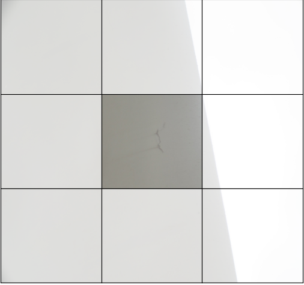
</p>


<p align="center">
    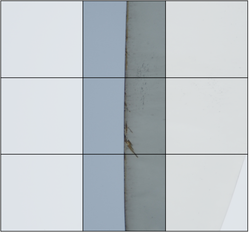
</p>


<br/><br/>


###  <u>TEST 3</u>

To compare the performance of the obtained model with the Google Cloud Platform AutoML, *ds01-v02-w9-rs224* was uploaded to a storage bucket and a model was obtained using Auto ML vision. The model can be found in ```./local_test/models/model-gcp-test2```, and the training took 2 hours. The tool does 80-10-10 data split into train-validation-test. The model metrics obtained from the validation set are precision of 0.927, and recall of 0.925. Further, for the "damaged" images the precision and recall are 0.90 and 0.84 respectively. For the "n-a" images the precision and recall are 0.93 and 0.96 respectively. The confusion matrix, obtained from the test set (110 images) is the following:

 TRUE\PREDICTED     | n-a     | damaged     |
| :------------- | :----------: | :-----------: | 
|  n-a |  96% |   4% |
|  damaged | 16%   | 84%   | 


<br/><br/>

The GCP model has a slighlty better performance than the one built from scratch. However, our model allows much more freedom, and was much faster to train. 


###  <u>TEST 4</u>

The goal of this test is to classify the iamges based on the localization. To do so, the complete high-resolution images will be used as input of the CNN. The test was performed on *ds-02-rs500-v02* dataset. *ds-02* consists of all the images from previous *ds-01* and the ones extracted from the reports (high resolution). In total, there are around 2.1k images of all kinds. The first step was to clean the raw images, obtaining 1542 images. Next, the images were resized to 500x500 and manually labeled in five different classes: 'aerofreno' (328), 'borde'(657), 'elemento aerodinamico'(190), 'pieza'(56) and 'punta'(311).

The architecture is very similar to the one used in the previous tests. ResNet50 was used as bade model, and no fine tuning extra epochs were added (they were not improving the performance. The hyperparameters used are the following:


  Prediction head: GlobalAveragePooling2D + Dropout + Dense(5,activation='sigmoid')

	Base model: ResNet50 on Imagenet

	Data augmentation: RandomFlip(0.2) + RandomRotation + RandomContrasts (0.6)

	Frozen_epochs: 40

	Unfrozen epochs: 30

	Batch size: 32

	Dropout rate: 0.1

	Optimizer: Adam

	Initial learning rate: 0.0001

	Learning rate decrease factor: 100

	Unfrozen layers: 100

<p align="center">
    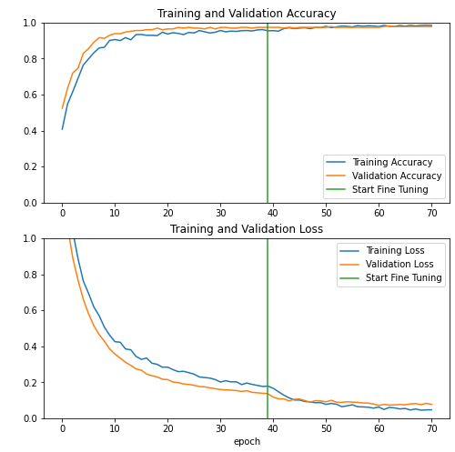
</p>


Remark that to obtain the labels, argmax is applied on the output tensor. The following is the obtained confusion matrix on the validation set.

| True/Predicted     | Aerodinamico     | Aerofreno     | Borde | Pieza | Punta |
| :------------- | :----------: | :-----------: | :------:|  :-------: | :------: |
|  Aerodinamico |  26 |   0 | 0 | 0 | 2
|  Aerofreno | 0   | 49   | 0 | 0 | 0
|  Borde| 0   | 1    | 96 | 0 | 1
|  Pieza | 0  | 0    | 0 | 8 | 0
|  Punta | 0  | 0   | 1 | 0 | 45


###  <u>TEST 5</u>

Based on the images provided to us in the reports, damages located in the 'aerofreno' are very common. However, these damages were not present in the *ds-01*, and the damage type is significantly different to the ones present in *ds-01*. Therefore, the goal is to train a classifier with teh ability to predict 'damaged' or 'n-a' of these 'aerofreno' images. The techniques are very similar to the ones used in previous tests. *ds02-w9-rs224-t5* was manually constructed from the reports. First, 327 'aerofreno' images were extracted from *ds-02*. Then, the iamges were croped and manually labeled as 'n-a' or 'damaged'. The resulting dataset contained 870 'n-a' crops, and 173 'damaged' crops. 80%-20% training and validation split was followed. In test time, the number of 'n-a' iamges was reduced to avoid a huge class- imbalance. However, the performance was very similar to using all the images, and the final decision was to consider all the 870 crops.  

  Prediction head: GlobalAveragePooling2D + Dropout + Dense(5,activation='sigmoid')

	Base model: ResNet50 on Imagenet

	Data augmentation: RandomFlip(0.2) + RandomRotation + RandomContrasts (0.6)

	Frozen_epochs: 70

	Unfrozen epochs: 30

	Batch size: 32

	Dropout rate: 0.1

	Optimizer: Adam

	Initial learning rate: 0.0001

	Learning rate decrease factor: 10

	Unfrozen layers: 75


  The obtained accuracy values during training were a training accuracy of 0.9882 and a validation accuracy of 0.9519. The following is the obtained confusion matrix in the validation set, usign a 0.7 classification threshold (higher than 0.5 to decrease the number of true damages classified as n-a). 

 TRUE\PREDICTED     | n-a     | damaged     |
| :------------- | :----------: | :-----------: | 
|  n-a |  158(96.9%) |   5(3.1%) |
|  damaged | 4(12.5%)   | 28(87.5%)   | 

  The model has a precision of  0.97 and recall of 0.96 on the validation set. The following are the four missed damaged images: 

  <p align="center">
    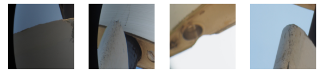
  </p>


  The code of the test can be found in ```test5.py```. Remark that future work involves using cross-validation to verify the performance of the model, and an ensemble of models to increase the performance.  


###  <u>LOCAL DEMO</u>


A toy demo has been constructed to show how all the models come to play together in a 'real' prediction tool. First, the model from test 4 is used to classify the location of the image. Then, the 'aerofreno' images are croped into 9 sub-images and classified usign the model obtained in test 5. The rest of the images are croped and classified using the model from test 3. In summary, the input of the complete model is an image, and the output are the localziation and the classification of each crom as 'n-a' and 'damaged'. In the demo, the 'damaged' crops are highlighted with a red quare. A green frame is added to the complete image if all the crops are 'n-a'. The code can be found in the ```/demo/demo_local``` directory.


###  <u>GCP DEMO</u>

A little web app has been constructed using Python and Flask. The goal was to host the models in the GCP AI platform, and get online requests using the API provided by AI Platform. The code can be found in the ```/demo/demo_gcp``` directory. 

### LOCALIZATION MODEL 1.0

Based on the second batch of reports, we already have a decent amount of images to do real tests. The goal is to design a model with the ability to localize the images in the blade. The first step consisted on merging ds-02, old report images and new report images into one directory. Then, they were manually labeled into eight classes: borde (edge), pieza (piece), raíz(root), aerodinámico (aerodinamic), punta (tip), aerofreno(airbrake), completo (complete) and zoom (zoom). Remark that the eight locations were chosen by me. 


  <p align="center">
    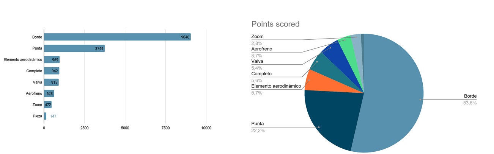
  </p>


Then, the set of images was randomly splited into train and valdiation set (80%-20%). This dataset is called localization-ds (I call it like that because it is the first real dataset, previous ones were for testing). The dataset has been uplaoded to Xabet Google Cloud. The following is the localization dataset structure:

    1. Train 13569

      1.1 Borde

      1.2 Punta

      1.3 Aerodinámico

      1.4 Completo

      1.5 Raíz

      1.6 Aerofreno

      1.7 Zoom

      1.8 Pieza

       
    2. Validation 3396

      2.1 Borde

      2.2 Punta

      2.3 Aerodinámico

      2.4 Completo

      2.5 Raíz

      2.6 Aerofreno

      2.7 Zoom

      2.8 Pieza
 


Due to hardware limitations, to reach a decent training time the resolution was downgraded to 150x150 (224x224 was also tryed but max batch size that COalb was reach was 2, and training took too long). With a 150x150 resolution, I was able to use a batch size of 32 in Colab (15GB of RAM).  The model has been selected based on the knowledge gained on the test 4, using tranfer learning with ResNet50 as backbone model doing a fine tuning phase after a fixed epoch. The following are the model hyperparmeters:IMG_SIZE, Backbone model, Batch size, Initial learning rate, Loss function, Optmizer, Frozen_epochs, Unfrozen_epochs, Unfrozen_layers, Learning rate decrease ratio, Dropout ratio. 


The hyperparameter tuning has been realized using a greedy/random aproach. Basically, different values has been selected and the value of the accuracy has been observed. Each training took around 15-30 minutes (depending on the number of epochs), and doing a grid-search was unfeasible. The folowing is the final model that obtained the highest accuracy on the validation set


  1. IMG_SIZE = (150, 150)

  2. Backbone model = Resnet50 (Imagenet weights)

  3. Batch size = 32

  4. Initial learning rate = 0.001

  5. Loss function = SparseCategoricalCrosEntropy

  6. Optimizer = Adam

  7. Frozen_epochs = 30

  8. Unfrozen_epochs = 50

  9. Learning rate decrease ratio = 100

  10. Unfrozen_layers = 100

  11. Dropout ratio = 0.5


The model has a vector of size 8 as output, and the predicted class is obtained using the argmax function. The following is the train/val accuracy plot:

<p align="center">
    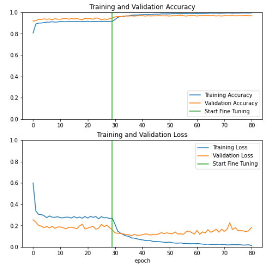
  </p>
      
The obtained accuracy is ~96.5%, and the following is the obtained confusion matrix on the validation set.

| True/Predicted     | Aerodinamico     | Aerofreno     | Borde | Competo | Pieza | Punta | Raiz | Zoom | PERCENTAGE OF CORRECT PREDICTIONS
| :------------- | :----------: | :-----------: | :------:|  :-------: | :------: |:------: |:------: | :------: | :------: 
|  Aerodinamico |  183 |  0 | 6 | 0|  0 | 1 | 0 | 5 | 93.8
|  Aerofreno | 0 |  125 | 0 | 0|  0 | 1 | 0 | 0 | 99.2
|  Borde| 8 |  0 | 1763 | 0|  0 | 18 | 3 | 6 | 98.0
   Completo | 0 |  0 | 0 | 183|  0 | 4 | 5 | 0 | 95.3
|  Pieza | 0 |  0 | 0 | 0|  29 | 0 | 0 | 0 | 100
|  Punta | 3 |  0 | 24 | 2|  0 | 717 | 1 | 3 | 95.6
   Raiz | 0 |  0 | 2 | 3|  0 | 2 | 178 | 0 |96.2
   Zoom | 0 |  0 | 9 | 0|  0 | 0 | 0 | 108 | 92.3


The Google Colab Notebook used to train the localization model can be found in ```/local_test/localization-setup```.


Remark that the data imbalance is a present challengue in this dataset. It can be observed that the ZOOM class has the lowest preiction percentage, despite being very different from the rest (all white images). Future work involves using techniques to solve this issue and increase accuracy. 

The following are intermedate representations of the neural network, just for visualization purpose:


 <p align="center">
    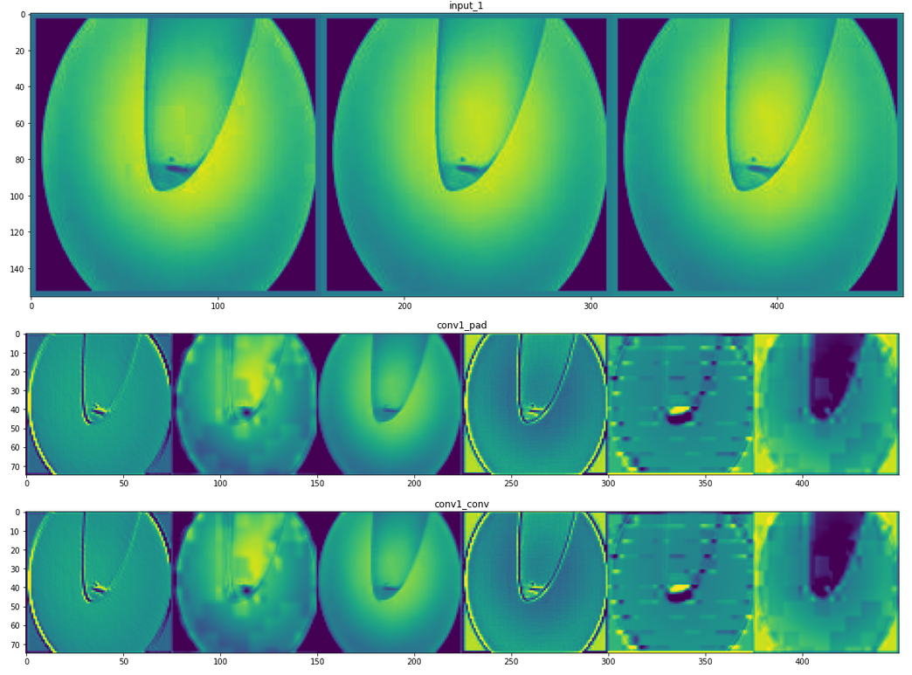
  </p>

  <p align="center">
    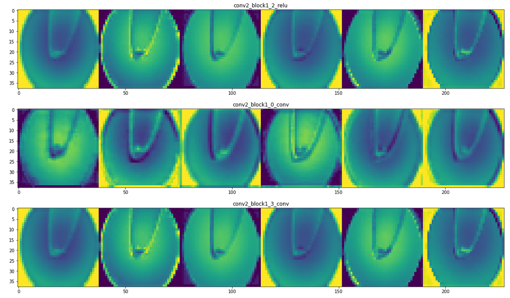
  </p>